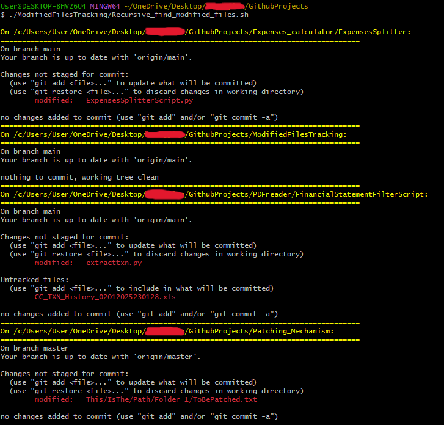

# ModifiedFilesTracking
This simple bash script allows one to track all the changes done in a folder that contains alot of sub git repositories

# Background
Most of the time, developers work on a project where they have to checkout a meta repository that contains many subdirectories. These subdirectories can be git repositories and the git repositories can be also subdirectories within subdirectories. Hence, after implementing changes on the code, developers may have a hard time tracking their changes in different repositories.

# Usage of the script
This script allows developers to solve this issue because it iterates the entire directory tree to locate git repositories and track the changes of the files.
Simply just checkout this repo, copy the script into the root directory and run the script, it will iterate all the subdirectories within the folder.

Example of Usage:

